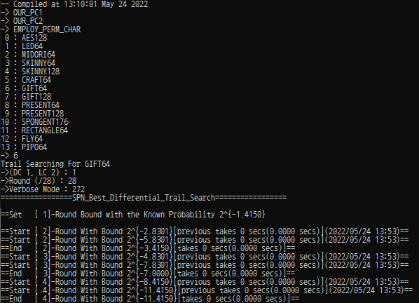
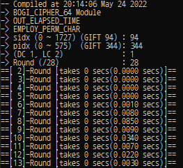
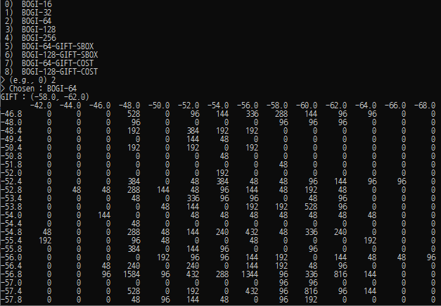

# **Accelerating the Best Trail Search on AES-Like Ciphers**

This repository includes tools for the best differential and linear trails of AES-like ciphers and more detailed data for the paper
### "ToSC 2022 Issue 2 : Accelerating the Best Trail Search on AES-Like Ciphers".
---
## Ⅰ. Intro

- There are **two tools** for the best differential and linear trails of AES-like ciphers.
- The first tool is for **general AES-like ciphers** and placed in “/AES_Like_Ciphers”.
- The second tool is dedicated to **BOGI-based ciphers** and placed in “/BOGI_Based_Ciphers”.
- The data we obtained for the paper is placed in "/Obtained_Data".


---
## Ⅱ. Build
- Currently, the codes for both tools can be compiled with **Visual Studio 2017**.
- Since the visual studio solutions include projects for Windows and Linux environments, one can build the search programs for both environments.
- Search functions are included in a shared library (ASTBB_Windows.dll or ASTBB_Linux.so). Therefore, one may use the search functions in another C program or python script.

### 1. Pre-Built Binaries
- If there are some problems when following the below manual, one may use the pre-built binaries in “/{AES_Like_Ciphers, BOGI_Based_Ciphers}/Pre_Built_Binaries”.
- The pre-built libraries and C programs to handle them are placed in “/{AES_Like_Ciphers, BOGI_Based_Ciphers}/Pre_Built_Binaries/C”.
- The pre-built libraries and a python script to handle them are placed in “/{AES_Like_Ciphers, BOGI_Based_Ciphers}/Pre_Built_Binaries/Python”.

### 2. For Windows

- **(IMPORTANT!)** Set the options as [Configuration : Release], [Platform : x64]
- ASTBB_Windows, ASTBB_Handle_Windows Projects are used.
    - ASTBB_Windows : This project produces the main library (ASTBB_Windows.dll, ASTBB_Windows.lib) that includes search functions.
    - ASTBB_Handle_Windows : This project only includes “astbb_main.c” to handle the main library.
- **Build Steps**
    1. Build “ASTBB_Windows” **AND** then “ASTBB_Handle_Windows” Porjects.
    2. They provide “ASTBB_Windows.dll” and “ASTBB_Handle_Windows.exe” in “\{AES_Like_Ciphers, BOGI_Based_Ciphers}\x64\Release”.
    3. Execute “ASTBB_Handle_Windows.exe” in “\{AES_Like_Ciphers, BOGI_Based_Ciphers}\x64\Release”.

### 3. For Linux

- **(IMPORTANT!)** Set the options as [Configuration : Release], [Platform : x64]
- At the moment, one has to set the option “Remote Build Machine” on each Project Property Page.
- “Remote Build Machine” can be Windows Subsystem for Linux (WSL) or Remote OS. <br>
        Please check [https://docs.microsoft.com/en-us/cpp/linux/connect-to-your-remote-linux-computer?view=msvc-150](https://docs.microsoft.com/en-us/cpp/linux/connect-to-your-remote-linux-computer?view=msvc-150).
- ASTBB_Linux, ASTBB_Handle_Linux Projects are used.
    - ASTBB_Linux : This project produces the main library (libASTBB_Linux.so) that includes search functions.
    - ASTBB_Handle_Linux : This project only includes “astbb_main.c” to handle the main library.
- **Build Steps**
    1. Build “ASTBB_Linux(Linux)” **AND** then “ASTBB_Handle_Linux(Linux)” Projects.
    2. They provide “libASTBB_Linux.so” and “ASTBB_Handle_Linux.out” in “/{AES_Like_Ciphers, BOGI_Based_Ciphers}/x64/Release”.
    3. Execute “ASTBB_Handle_Linux.out” in “/{AES_Like_Ciphers, BOGI_Based_Ciphers}/x64/Release”.<br>
    ※ It may not find “libASTBB_Linux.so”. If then, type “export LD_LIBRARY_PATH=$LD_LIBRARY_PATH:./”.

### 4. For Python Script
- One can handle the main library in a python script.
- The python script we used is placed in “/{AES_Like_Ciphers, BOGI_Based_Ciphers}/ASTBB_Wrapper/astbb.py”.
- This python script may be more useful than the C program that is built with ASTBB_Handle_Windows or ASTBB_Handle_Linux.
    - In particular, we used the python script to search the best trails of BOGI-based ciphers with python package **multiprocessing**. <br>
    Please check [https://docs.python.org/3/library/multiprocessing.html](https://docs.python.org/3/library/multiprocessing.html).

    **In the Folder “/AES_Like_Ciphers”,**
    - After the projects (ASTBB_Linux) or (ASTBB_Windows) are built, the main library should be placed in “/AES_Like_Ciphers/ASTBB_Wrapper/ASTBB/x64/Release”.
    - Therefore, one doesn't have to do an additional step.
    
    **In the Folder “/BOGI_Based_Ciphers,”**
    - Since there are 6 different libraries to be built depending on the block size, one has to do additional steps to use the python script.
    - The additional steps are given in **2.3 Python Script (astbb.py)**.

---
## Ⅲ. Usage

### 1. Tool for General AES-Like Ciphers (/AES_Like_Ciphers)

#### 1.1 C Programs (ASTBB_Handle_Windows.exe, ASTBB_Handle_Linux.out)


1. Execute “ASTBB_Handle_Windows.exe” and “ASTBB_Handle_Linux.out” are executed.<br>
   ※ Note they require the main libraries, ASTBB_Windows.dll and ASTBB_Linux.so, respectively.
2. Choose a block cipher to be analyzed : {1 ~ 13}.
    - Currently, the tool includes the following block ciphers.
        - AES, LED, MIDORI-64, CRAFT, SKINNY-64, SKINNY-128 <br>
            : These block ciphers correponds to the considered *non-bit permutation-based AES-like ciphers* in the paper.
        - GIFT-64, GIFT-128, PRESENT <br>
            : These block ciphers correponds to the considered *bit permutation-based AES-like ciphers* in the paper.
        - RECTANGLE, FLY, PIPO, SPONGENT-176 <br>
            : Although these block ciphers and hash function are not presented in the paper, we added them.
4. Choose the option : {DC 1, LC 2}
5. Choose the analysis round : The maximum analysis round is different depending on the chosen cipher.
6. Verbose Mode : There are 8 options (Multiple-choise is possible by adding the following options).
    
    
    | Options | Value | Description |
    | --- | --- | --- |
    | VV_ROUND_PROGESS | 0b000000001 (1) | Not Available |
    | VV_UPDATE_BOUND | 0b000000010 (2) | STDOUT : When a New Bound is found, it is printed.  |
    | VV_UPDATE_BOUND_TRAIL | 0b000000100 (4) | STDOUT : When a New Bound is found, the corresponding trail is printed. |
    | VV_LAST_UPDATE_TRAIL | 0b000001000 (8) | STDOUT : The found best trail for each round is printed. |
    | VV_PROGRESS | 0b000010000 (16) | STDOUT : Search progress is printed. |
    | VV_LAST_RESULT | 0b000100000 (32) | STDOUT : The best weight for each round is printed after the search finishes. |
    | VV_ACTIVE_MAP_PROGRESS | 0b001000000 (64) | Not Available |
    | VV_ETA | 0b010000000 (128) | Not Available |
    | VV_FILE_PRINT | 0b100000000 (256) | FILEOUT : The found best trail for each round is printed in text files. |
    
    ※ In particular, we used (VV_PROGRESS + VV_FILE_PRINT) : 0b100010000 (272).
    

#### 1.2 Python Script (astbb.py)

- **Analyzing AES-like ciphers**
    - This python script supports analyzing AES-like ciphers that employ a bit permutation or binary matrix.<br>
    **IMPORTANT!** the following classes are not **WELL** optimized and do not apply some acceleration points that the paper suggests.<br>
    Especially, permutation characteristics are **NOT** applied when the below classes are used.
        - Use the class : SBPN_Cipher<br>
            Example
        
            ```python
            #Example 1 - GIFT
            sbox_lut       = (1, 10, 4, 12, 6, 15, 3, 9, 2, 13, 11, 7, 5, 0, 8, 14) # GIFT-Sbox
            perm_idx       = (
                12, 1, 6, 11, 28, 17, 22, 27, 44, 33, 38, 43, 60, 49, 54, 59, 8, 
                13, 2, 7, 24, 29, 18, 23, 40, 45, 34, 39, 56, 61, 50, 55, 4, 9, 
                14, 3, 20, 25, 30, 19, 36, 41, 46, 35, 52, 57, 62, 51, 0, 5, 10, 
                15, 16, 21, 26, 31, 32, 37, 42, 47, 48, 53, 58, 63) #GIFT-64 bit permutation
            bb = SBPN_Cipher(
                num_round = 7,
                num_word_in_a_state = 16,
                word_bit_size = 4,
                distinct_sbox = FALSE,
                sboxes        = sbox_lut,
                num_diff_of_partial_diffusion = 4,                 #The size of M in Mixing Layer.
                perm_idx      = perm_idx
                )
            bb.DC_Prob_Searching(
                enable_1round_active_map = TRUE,
                rotational_symmetric_equivalent = FALSE,
                verbose = 272
                )
            print(bb.DC_Prob_Results)
            bb.LC_Corr_Searching(
                enable_1round_active_map = TRUE,
                rotational_symmetric_equivalent = FALSE,
                verbose = 272
                )
            print(bb.LC_Corr_Results)
            ```
            
        - Use the class : SBMN_Cipher<br>
            Example
            
            ```python
            ##Example 2 - MIDORI-64
            sbox_lut       = (12, 10, 13, 3, 14, 11, 15, 7, 8, 9, 1, 5, 0, 2, 4, 6) # MIDORI-Sbox
            bin_mat = [
                0, 1, 1, 1, 
                1, 0, 1, 1,
                1, 1, 0, 1,
                1, 1, 1, 0
                ]
            inv_bin_mat = bin_mat
            trans_bin_mat = bin_mat
            inv_trans_bin_mat = bin_mat
            shuffle_idx  = (0, 10, 5, 15, 14, 4, 11, 1, 9, 3, 12, 6, 7, 13, 2, 8)

            bb = SBMN_Cipher(
                num_round = 3,
                num_word_in_a_state = 16,
                word_bit_size = 4,
                distinct_sbox = FALSE,
                sboxes = sbox_lut,
                num_diff_of_partial_diffusion = 4,                 #The size of M in Mixing Layer.
                bin_mat       = bin_mat,                           #Midori Matrix M
                inv_bin_mat   = inv_bin_mat,                       #M = M^{-1}
                diff_branch_num = 4,                               #Branch Number
                inv_trans_bin_mat = inv_trans_bin_mat,             #M = M^{-T}
                trans_bin_mat     = trans_bin_mat,                 #M = M^{T}
                inv_trans_diff_branch_num  = 4,
                shuffle_idx       = shuffle_idx                    # The sigma of Shuffle Layer
                )
            bb.DC_Prob_Searching(
                enable_1round_active_map = TRUE,
                rotational_symmetric_equivalent = FALSE,
                verbose = 272
                )
            print(bb.DC_Prob_Results)
            bb.LC_Corr_Searching(
                enable_1round_active_map = TRUE,
                rotational_symmetric_equivalent = FALSE,
                verbose = 272
                )
            print(bb.LC_Corr_Results)
            ```
            

- **Analyzing BOGI-based ciphers**
    - This python script also supports analyzing BOGI-based ciphers. **HOWEVER**, it is **NOT** the library we used to analyze BOGI-based ciphers.
    - The usage for the dedicated tools is given in **2. Tool for BOGI-Based CIphers**.
        - Use the classes : BOGI16_Cipher, BOGI32_Cipher, BOGI64_Cipher, BOGI128_Cipher, BOGI256_Cipher.
        
            Example 
        
            ```python
            analysis_round = 28
            bogi_sbox_idx  = 94   #This must be 0 ~ 1727, GIFT_SBOX_IDX = 94
            bogi_pbox_idx  = 344  #This must be 0 ~ 575,  GIFT_PBOX_IDX = 344
            verbose_mode   = 272  #The verbose mode can be set as the above.
            bb = BOGI64_Cipher(analysis_round, bogi_sbox_idx, bogi_pbox_idx)
            bb.DC_Prob_Searching(verbose_mode)
            print(bb.DC_Prob_Results)
            bb.LC_Corr_Searching(verbose_mode)
            print(bb.LC_Corr_Results)
            ```


### 2. Tool for BOGI-Based CIphers (/BOGI_Based_Ciphers)

#### 2.1 Dedicated Build Options

- When building the main library (ASTBB_Windows.dll, libASTBB_Linux.so) for BOGI-based ciphers, one must choose the module build options.
- The build options can be choosen in “/BOGI_Based_Ciphers/Lib_Source/Out/astbb.h”.
    
    
    | Options |  Description |
    | --- | --- |
    | EMPLOY_PERM_CHAR | If it is defined, the module applies the permutation characteristics. Otherwise, the module doesn’t. |
    | PRINT_PSHUF_INPUT | FILEOUT : If it is defined, the module prints the input of Shuf in each file. |
    | OUT_ELAPSED_TIME | STDOUT : If it is defined, the module prints the elasped time during the search for each round. |
    | BOGI_CIPHER_XX   | One must define only one of them. BOGI_CIPHER_XX : The Module can only analyze BOGI-XX. |
    
    Setting Example for C-Programs : We used the following settings to check **the elasped time**.
    
    ```c
    // In /BOGI_Based_Ciphers/Lib_Source/Out/astbb.h
    /*
    *  Module Build Options
    */
    
    #define EMPLOY_PERM_CHAR
    
    //#define PRINT_PSHUF_INPUT
    #define OUT_ELAPSED_TIME
    
    /*
    *  One of the Following Options Must be chosen
    */
    //#define BOGI_CIPHER_16
    //#define BOGI_CIPHER_32
    #define BOGI_CIPHER_64
    //#define BOGI_CIPHER_128
    //#define BOGI_CIPHER_176
    //#define BOGI_CIPHER_256
    ```
    
    Setting Example for Python Script : We used the following settings to build the module to remove the stdout.
    
    ```c
    // In /BOGI_Based_Ciphers/Lib_Source/Out/astbb.h
    /*
    *  Module Build Options
    */
    
    #define EMPLOY_PERM_CHAR
    
    //#define PRINT_PSHUF_INPUT
    //#define OUT_ELAPSED_TIME
    
    /*
    *  One of the Following Options Must be chosen
    */
    //#define BOGI_CIPHER_16
    //#define BOGI_CIPHER_32
    //#define BOGI_CIPHER_64
    #define BOGI_CIPHER_128
    //#define BOGI_CIPHER_176
    //#define BOGI_CIPHER_256
    ```
    

#### 2.2 C Programs (ASTBB_Handle_Windows.exe, ASTBB_Handle_Linux.out)


1. Execute “ASTBB_Handle_Windows.exe” or “ASTBB_Handle_Linux.out”. 
2. Choose the BOGI-applicable S-box Index : {0 ~ 1727}.
3. Choose the Latin Square (M_{BOGI}) Index : {0 ~ 575}. 
    - 24 out of 576 are the Representative Latin Squares as presented in the paper.
    - The representative indexes are (0, 1, 4, 6, 24, 25, 28, 30, 48, 50, 51, 54, 72, 74, 76, 77, 96, 98, 99, 102, 122, 124, 125, 344).
4. Choose the option : {DC 1, LC 2}
5. Choose the analysis round : The maximum analysis round is different depending on the block size.

#### 2.3 Python Script (astbb.py)

- This script may be more useful to analyze BOGI-based ciphers than the above C programs.
    - **Additional Build Steps**
        1. However, each module for the different block sizes is complied and then renamed.<br>
        ※ It is better not to define “OUT_ELAPSED_TIME”.
            | Block Size (Module Build Option) | Rename “libASTBB_Linux.so” and “ASTBB_Windows.dll” to |
            | --- | --- |
            | 16-bit (BOGI_CIPHER_16) | libASTBB_Linux_16.so, ASTBB_Windows_16.dll |
            | 32-bit (BOGI_CIPHER_32) | libASTBB_Linux_32.so, ASTBB_Windows_32.dll |
            | 64-bit (BOGI_CIPHER_64) | libASTBB_Linux_64.so, ASTBB_Windows_64.dll |
            | 128-bit (BOGI_CIPHER_128) | libASTBB_Linux_128.so, ASTBB_Windows_128.dll |
            | 176-bit (BOGI_CIPHER_176) | libASTBB_Linux_176.so, ASTBB_Windows_176.dll |
            | 256-bit (BOGI_CIPHER_256) | libASTBB_Linux_256.so, ASTBB_Windows_256.dll |
    
        2. Move the renamed modules into “/BOGI_Based_Ciphers/ASTBB_Wrapper/ASTBB/x64/Release”.
        3. Use the script “/BOGI_Based_Ciphers/ASTBB_Wrapper/astbb.py”.
    - Use the classes : BOGI16_Cipher, BOGI32_Cipher, BOGI64_Cipher, BOGI128_Cipher, BOGI256_Cipher.
        Examples in the script “astbb.py”.
        
        ```python
        import numpy as np
        
        analysis_round = 5
        bogi_sbox_idx  = 94   #This must be 0 ~ 1727, GIFT_SBOX_IDX = 94
        bogi_pbox_idx  = 344  #This must be 0 ~ 575,  GIFT_PBOX_IDX = 344
        
        bb = BOGI16_Cipher(analysis_round, bogi_sbox_idx, bogi_pbox_idx)
        bb.DC_Prob_Searching()
        print(np.round(bb.DC_Prob_Results, 1))
        bb.LC_Corr_Searching()
        print(np.round(bb.LC_Corr_Results, 1))
        
        bb = BOGI32_Cipher(analysis_round, bogi_sbox_idx, bogi_pbox_idx)
        bb.DC_Prob_Searching()
        print(np.round(bb.DC_Prob_Results, 1))
        bb.LC_Corr_Searching()
        print(np.round(bb.LC_Corr_Results, 1))
        
        bb = BOGI64_Cipher(analysis_round, bogi_sbox_idx, bogi_pbox_idx)
        bb.DC_Prob_Searching()
        print(np.round(bb.DC_Prob_Results, 1))
        bb.LC_Corr_Searching()
        print(np.round(bb.LC_Corr_Results, 1))
        
        bb = BOGI128_Cipher(analysis_round, bogi_sbox_idx, bogi_pbox_idx)
        bb.DC_Prob_Searching()
        print(np.round(bb.DC_Prob_Results, 1))
        bb.LC_Corr_Searching()
        print(np.round(bb.LC_Corr_Results, 1))
        
        bb = BOGI176_Cipher(analysis_round, bogi_sbox_idx, bogi_pbox_idx)
        bb.DC_Prob_Searching()
        print(np.round(bb.DC_Prob_Results, 1))
        bb.LC_Corr_Searching()
        print(np.round(bb.LC_Corr_Results, 1))
        
        bb = BOGI256_Cipher(analysis_round, bogi_sbox_idx, bogi_pbox_idx)
        bb.DC_Prob_Searching()
        print(np.round(bb.DC_Prob_Results, 1))
        bb.LC_Corr_Searching()
        print(np.round(bb.LC_Corr_Results, 1))
        ```
        
---
## Ⅳ. Obtained Data

### 1. The Best Trails of the Considered Block Ciphers

- The best trails of the considered Block Ciphers can be found in “/Obtained_Data/Best_Trails_of_Considered_Ciphers”.
- As presented in the paper, the considered block ciphers are AES, LED, MIDORI-64, CRAFT, SKINNY-64, SKINNY-128, GIFT-64, GIFT-128, PRESENT.

### 2. The Best Trails and Weights of BOGI-Based Ciphers

- As presented in the paper, we have already analyzed all the combinations for BOGI-16, -32, -64, -128 (some combinations for BOGI-256).<br>
    (Note that each of version includes 2^{37.09} combinations.)
- The python script “/Obtained_Data/Best_Weights_of_BOGI-Based_Ciphers/bogi_class.py” support to demonstrate the analyzed data as follows.



- The python script demonstrates totally 1728 X 576 = 995,328 combinations.
- The best trails can be found in the compressed files “__data/BOGI*.tar.bz2”
